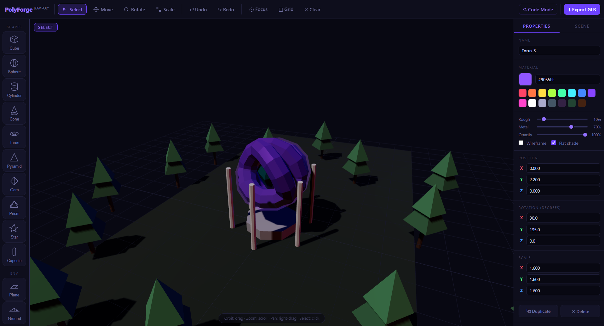

Here is a direct, fluff-free README file written to explain exactly what the tool is, how each section works, and how to use the scripting language.

***

# PolyForge – Low Poly 3D Modeler

PolyForge is a lightweight, single-file web application for building and exporting low-poly 3D models. It combines classic click-and-drag viewport editing with a procedural text-scripting engine called PolyScript.



## What It Does

* **Interactive Viewport:** Click, select, and transform primitive shapes using visual gizmos.
* **Property Controls:** Adjust PBR materials (colors, roughness, metalness, opacity, and flat shading) and exact position/rotation/scale coordinates.
* **Hierarchical Scene List:** View, select, or delete items from a flat list of objects currently in the scene.
* **PolyScript Engine:** Run text-based commands, math expressions, and loops to generate procedurally built models from scratch.
* **Undo/Redo System:** Steps backward and forward through visual changes and code executions.
* **GLB Export:** Saves models directly to standard GLTF Binary (`.glb`) files to use in other 3D software (Blender, Unity, Godot, etc.).

---

## The UI: This Does That

### 1. Viewport (Center)
* **Select shapes:** Left-click an object to highlight it and load its properties.
* **Rotate camera (Orbit):** Left-click and drag in empty space.
* **Pan camera:** Right-click and drag.
* **Zoom camera:** Scroll wheel.

### 2. Top Bar
* **Select / Move / Rotate / Scale Buttons:** Toggles the active manipulation gizmo on the selected object.
* **Undo (↩) / Redo (↪):** Backtracks or restores up to 40 operations.
* **Focus (⊙):** Repositions the camera to frame the selected object.
* **Grid (⊞):** Toggles the ground layout grid lines.
* **Clear (✕):** Wipes all objects from the scene.
* **Code Mode (⚗):** Opens the PolyScript editing modal.
* **Export GLB (⬇):** Saves the current layout as a `.glb` asset.

### 3. Left Panel (Shapes)
* Clicking any shape button immediately adds that primitive to the scene. Supported shapes include cubes, spheres, cylinders, cones, toruses, pyramids, gems, prisms, stars, capsules, and ground planes.

### 4. Right Panel
* **Properties Tab:**
  * **Name:** Custom identifier for the scene graph.
  * **Material:** Hex input, visual color picker, or preset color buttons.
  * **Sliders:** Adjust Roughness (reflection scatter), Metalness (metallic mirror properties), and Opacity (transparency).
  * **Toggles:** Toggle wireframes or flat face normals.
  * **Coordinate Inputs:** Enter exact numerical values for Position, Rotation (degrees), and Scale.
* **Scene Tab:**
  * Shows a list of all active meshes. Click an item to select it, or click the **✕** icon to delete it.

---

## PolyScript Cheat Sheet

Running a script in **Code Mode** clears the scene and evaluates text instructions line-by-line.

### Base Commands
* `add <shape>` – Spawns a primitive shape (e.g., `add box`, `add cylinder`, `add sphere`). This focuses the engine's pointer onto the new object.
* `pos <x> <y> <z>` – Moves the active object.
* `rot <x> <y> <z>` – Rotates the active object (values are in degrees).
* `scale <x> <y> <z>` – Scales the active object.
* `color <#hex>` – Sets the active object's color (e.g., `color #ef4444`).
* `rough <0.0-1.0>` / `metal <0.0-1.0>` / `opac <0.0-1.0>` – Adjusts the surface finish of the active object.
* `name <text>` – Renames the active object.

### Variables & Math
Define scoped variables using standard math helpers (such as `sin`, `cos`, `PI`, `sqrt`, `random`):
```text
let radius = 5
let targetX = cos(0.5) * radius
```

### Loops
Create arrays or repetitive procedural patterns:
```text
for i = 1 to 10
  add box
  pos i 0.5 0
  color #ff4466
endfor
```

---

## How to Run

Because the editor is built as a single, self-contained HTML file, there are no packages to install:
1. Open `index.html` in any web browser.
2. The application will pull Three.js and its addon controls from the CDN automatically.